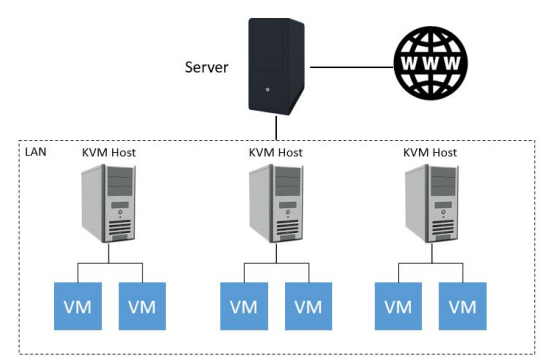
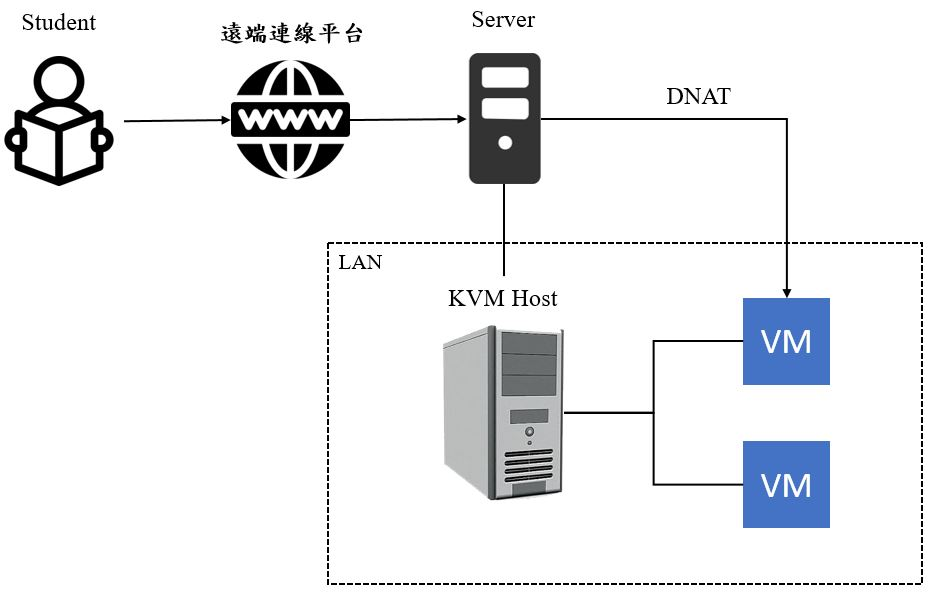
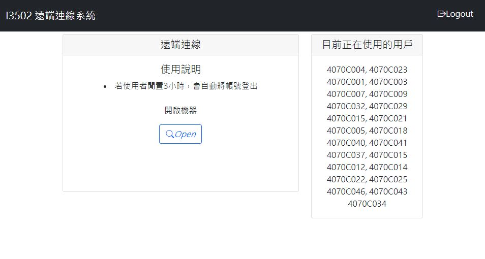
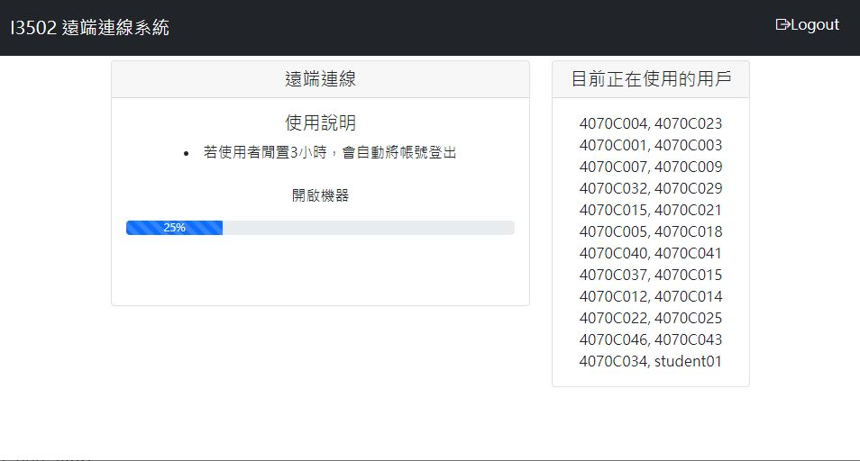
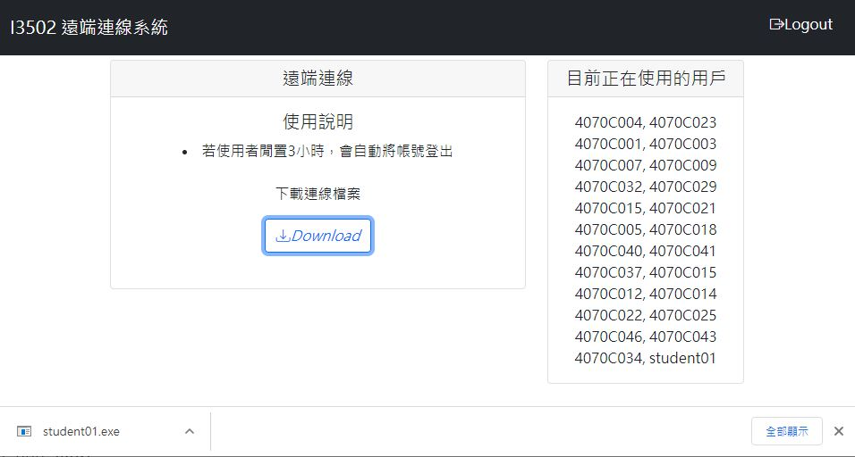
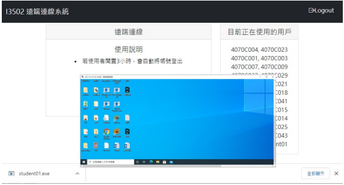

## 專題名稱
遠端隨選電腦系統平台開發

## 專題介紹
鑒於系上電腦教室環境為區域網路（LAN），故學生無法直接使用教室電腦之 IP 進行遠端連線之行為，本專題將規範 Windows 遠端連線機制，透過隨選電腦機制，利用 PREROUTING（DNAT）去對特定的外部 IP 位址放行，供使用者下載連線檔案並執行，就能對教室電腦使用遠端連線，建立一套運用於教學環境之監測電腦與學生在家也可以使用遠端連線取得教室桌面之系統。

另外目前系上管理電腦的方式為單台電腦監測，尚無統一平台針對實體電腦與虛擬機器進行管理， 因此本專題採用 SSH 方式，針對實體電腦硬體狀態進行監測， 以及利用 Netcat(NC)軟體，監測虛擬機器的運行。

> [!NOTE]
> 部分腳本需要連接伺服器和資料庫，若直接下載可能無法正常運行。

## 目錄說明
**web：** 前端為RWD響應式網頁，主要涵蓋HTML、CSS、Bootstrap、JavaScript、PHP檔案。分為管理員與使用者兩種權限，其主要管理介面包括遠端連線系統、下載連線檔案包、查看在線用戶和電腦狀態等

**script：** 涵蓋許多腳本，其主要功能包括篩選預備機、隨選電腦、動態防火牆、連線檔案製作、狀態監測和告警機制等功能

## 系統架構
教室內由一台 Server 作為主要控制端，網路規劃是採用內部區網。為針對特定外部 IP 位址放行，透過 iptables 控制 Linux 核心的 netfilter 模組，使用 DNAT 來管理網路封包的處理和轉發。若 KVM Host 為關機狀態，則會使用 Wake-on-LAN 機制喚醒休眠狀態或關機狀態的 KVM Host，並使其上之 VM 運行，讓使用者可以順利執行遠端連線作業。

| 教室架構圖 | 遠端連線架構圖 |
| --- | --- |
|  |  |

## Demo

| 系統介面 | 隨選電腦 |
| --- | --- |
|  |  |

| 下載連線檔案 | 遠端連線登入 |
| --- | --- |
|  |  |
